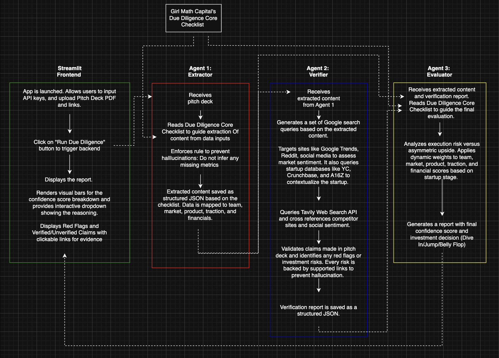
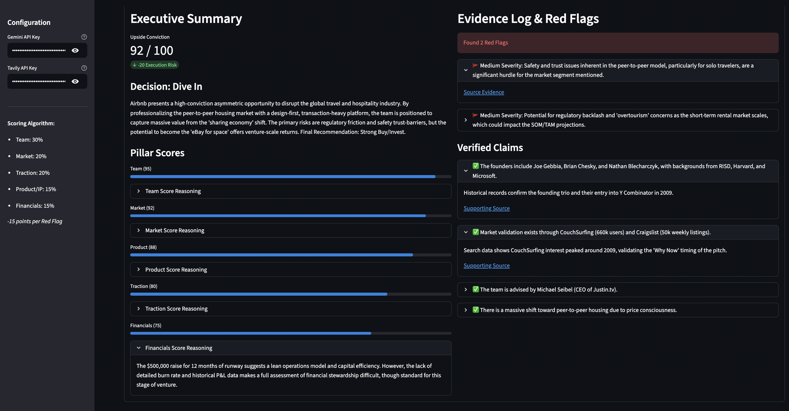

# 👼 Angel Insight: AI-Powered Due Diligence

> An automated multi-agent system designed to accelerate startup due diligence, extract metrics from pitch decks, verify claims and evaluate against real-time web data and social sentiment, generating a confidence score for each startup. 

## 📖 The TL;DR

In early-stage venture capital, analysts spend hours going through a complex due diligence process.

**Angel Insight** is a proof-of-concept AI application built to automate this grueling, unstructured pipeline.

By leveraging a multi-agent LLM architecture, this system ingests PDF pitch decks, ruthlessly fact-checks them using targeted web search (RAG), and calculates a dynamically-weighted "Confidence Score" to highlight asymmetric venture upside and catch red flags or investment risks.

I built this project to explore the intersection of Agentic AI and investment decision logic. I'm actively applying the concepts I'm learning through [Girl Math Capital](https://girlmath.capital/).

## 🧠 The Architecture (How to not let the LLM hallucinate)

Angel Insight uses a sequential, multi-agent pipeline enforcing deterministic, structured outputs.

### 1. 🕵️ Agent 1: The Extractor
- **The Goal:** Turn unstructured founder dreams into clean JSON schemas.
- **The Brains:** Uses Google Gemini to parse the document. It operates under strict prompting rules—specifically, if a metric like ARR or CAC is missing, it is forced to output "Not Provided" instead of hallucinating a number.
- **The Output:** A strict, `Pydantic`-validated JSON object mapping out the Team, Market, Product, Traction, and Financials.

### 2. 🔎 Agent 2: The Verifier (RAG & Web Grounding)
- **The Goal:** Fact-check the Extractor's findings against the real world.
- **The Brains:** This agent autonomously generates targeted search queries (via the Tavily API) to triangulate startup claims across Crunchbase, direct competitor websites, and social sentiment.
- **The Output:** It cross-references the original claims and tags them as "Verified" or "Unverified". It also throws "Red Flags" with assigned severities, citing the exact external URLs so you don't have to guess where it got the info.

### 3. ⚖️ Agent 3: The Evaluator
- **The Goal:** Synthesize all information into an actionable investment decision.
- **The Brains:** Computes a Confidence Score that dynamically shifts based on the startup's stage. For example, if the startup is pre-seed, the algorithm weighs the "Team" heavily and has less weightage on financials. If the startup is Series A, it pivots to aggressively prioritize traction and unit economics.
- **The Output:** A comprehensive executive snapshot of execution risk vs. potential upside. Provides a summary of analysis, risks with website evidence, confidence score breakdown, and final recommendation (Dive In/Jump/Belly Flop).





## 🛠 Tech Stack (The MVP Build)

- **Language:** Python
- **LLM Engine:** Google Gemini (Gemini-3-Flash-Preview)
- **Search Retrieval:** Tavily API
- **Data Validation:** Pydantic
- **Frontend:** Streamlit (For ultra-fast UI iteration)
- **Resilience:** Custom `@retry_on_demand_error` decorators utilizing regex to gracefully catch Google's 503/429 rate limit errors, parse the exact wait time, and pause execution instead of letting the pipeline crash mid-parse.

## ⚖️ Tradeoffs & Potential Solutions

Building an AI workflow inherently involves balancing speed, accuracy, and complexity. Here are the core tradeoffs made in this MVP and how I plan to resolve them:

1. **Sequential vs. Parallel Execution**
   - *Tradeoff:* The current pipeline runs sequentially (Extractor -> Verifier -> Evaluator). This ensures High Context injection into the Evaluator but creates high latency (~10-15 seconds per deck).
   - *Solution:* Refactor the pipeline using a Directed Acyclic Graph (DAG) with asynchronous execution. For example, some Verification steps (like checking founder backgrounds) can occur concurrently while the Extractor is pulling financial metrics.

2. **Public Web RAG vs. Proprietary Data**
   - *Tradeoff:* The Verifier agent relies on Tavily public web search. However, many early-stage startup metrics (ARR, churn) are kept private and won't appear in public search results.
   - *Solution:* Integrate proprietary financial API endpoints (like PitchBook or Crunchbase Enterprise APIs) directly into the Verifier agent's toolset to cross-reference private deal flow databases.

3. **Heuristic vs. Empirical Scoring Weights**
   - *Tradeoff:* The Evaluator uses hardcoded heuristic weights based on stage (e.g., Pre-Seed is 45% Team). While this mirrors VC intuition, it is a static rule engine.
   - *Solution:* Transition to an empirical scoring model. By ingesting thousands of historical pitch decks and their actual success/failure outcomes, we could train a traditional machine learning classifier to determine the optimal mathematical weights dynamically.

## 🚀 The Real Roadmap (Taking it to Production)

Here is what happens next:

1. **Deterministic Financial Modeling:** 
   - Moving beyond LLM qualitative vibes to integrate hard quantitative modeling to automatically calculate LTV/CAC ratios, burn rates, and lightweight DCF models.
2. **Empirical Confidence Scoring:**
   - Shifting the heuristic weights to an empirical engine. I plan to ingest historical datasets of successful vs. failed startups to train a dedicated classifier model, using the LLM's structured extracted outputs as training features.
3. **Enterprise MLOps Upgrade:**
   - Separate the UI from the agent orchestration.
   - Containerize the worker agents to process hundreds of pitch decks in parallel.
   - Change the storage structure from local JSON to a SQL database.

---

### How to Run Locally

1. Clone the repository.
2. Install dependencies:
   ```bash
   pip install -r requirements.txt
   ```
3. Create a `.env` file in the root directory and add your API keys:
   ```env
   GEMINI_API_KEY="your_api_key_here"
   TAVILY_API_KEY="your_api_key_here"
   ```
4. Boot the dashboard and evaluate a deal:
   ```bash
   streamlit run app/app.py
   ```
