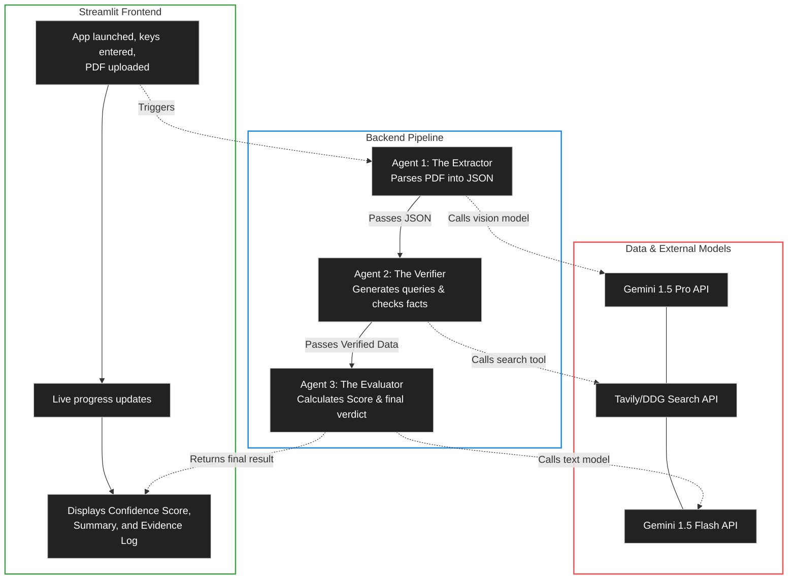

# Angel Insight MVP Implementation Plan

The goal is to build a Streamlit-based web application that acts as a due diligence assistant for angel investors. It uses a sequence of three AI agents to extract information from pitch deck PDFs, verify claims via web search, and evaluate the startup against a set of core due diligence questions to generate a Confidence Score.

## User Review Required
> [!IMPORTANT]
> The search functionality for Agent 2 (The Verifier) requires an external search API. I propose using the **Tavily API** (specifically designed for LLM agents) or the **DuckDuckGo** library (free, but less reliable for programmatic access). Let me know your preference and if you have an API key for a selected search provider.

## Proposed Changes

### Core Architecture & App Setup

- **Streamlit App (`app.py`)**: 
  - Sidebar for API key inputs (Gemini API key, Search API key).
  - Main panel with a file uploader for PDF pitch decks.
  - Usage of `st.status` or `st.spinner` to indicate the progress of the three agents.
  - Final dashboard layout using `st.columns`: Confidence Score metric, Summary Report, Evidence Log, and Red Flags.

---
### Agent 1: The Extractor (PDF Parsing & Information Extraction)
- **Model**: `gemini-1.5-pro`
- **Responsibilities**: 
  - Consume the uploaded PDF file bytes.
  - Answer the core checklist questions from `due_diligence_questions.md` based strictly on the document.
  - Output structured JSON containing data on the five pillars: Team, Market, Product, Traction, and Financials.
- **Implementation**: We will define a Pydantic schema for the expected JSON output and use Gemini's structured output/JSON mode capabilities to parse the pitch deck reliably.

---
### Agent 2: The Verifier (Claim Validation via Web Search)
- **Model**: `gemini-1.5-flash` + Search Tool
- **Responsibilities**:
  - Take the extracted JSON from Agent 1.
  - Generate specific search queries based on the PRD specification (e.g., "[Founder Name] LinkedIn", "[Industry] market size 2026 reports").
  - Execute searches and retrieve real-world data/links.
  - Compare deck claims against the search results to identify discrepancies or validate claims.
- **Implementation**: A Python service that formulates search queries, calls the Search API, feeds the search context to Gemini to check against the extraction, and outputs a JSON object containing "Verified Claims", "Red Flags", and a list of citation URLs for the Evidence Log.

---
### Agent 3: The Evaluator (Scoring & Executive Summary)
- **Model**: `gemini-1.5-flash`
- **Responsibilities**:
  - Ingest the outputs of Agent 1 and Agent 2.
  - Calculate the final Confidence Score using the PRD rules: Team 30%, Market 20%, Product/IP 15%, Traction 20%, Financials 15%.
  - Apply the 15-point penalty for any red flags identified by Agent 2.
  - Draft a concise Executive Summary.
- **Implementation**: A deterministic Python function for calculating the numerical score, combined with an LLM call to draft the summary text and cleanly format the final report.

## Open Questions
> [!WARNING]
> 1. **Search Tool Integration**: Do you have a preferred Search API (Tavily, SerpAPI, etc.) for Agent 2? Since this runs locally/in-memory for the MVP, we need an agreed-upon endpoint that will provide the links for the Evidence log.
> 2. **Evaluation Logic**: Should the Agent dynamically score each pillar 0-100 before applying the weights (e.g. Gemini rates the Team highly based on its judgment), or is the score purely based on the presence of verified data vs. red flags?
> 3. **Google API access**: For the "Native PDF" feature, will we be using the Google AI Studio (`google-genai` SDK) utilizing API Keys, or Google Cloud Vertex AI? The file handling is slightly different between the two.

## Verification Plan
1. **Automated / Module Testing**:
   - Create a dummy pitch deck PDF.
   - Run the Extractor to verify the Pydantic JSON schema is correctly populated from the PDF.
   - Execute the Verifier with mock or live search data to test discrepancy logic.
2. **Manual Verification**:
   - Run the full Streamlit app with an actual startup pitch deck.
   - Ensure the UI dynamically updates the status text as each agent finishes.
   - Verify that the Evidence Log contains at least 2 clickable links.
   - Confirm the Confidence Score calculation algorithm applies the correct weights and -15 penalty for red flags.
   - Confirm the end-to-end latency meets the <45 seconds PRD requirement.
